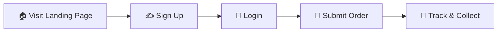

<div align="center">

# 🧺 Laundry Buddy

### *Smart Laundry Management for the Modern Student*

**No slips. No stress. Just clean clothes.**

[](https://choosealicense.com/licenses/mit/)
[](http://makeapullrequest.com)
[](https://github.com/Ayuuu-tech/Laundary-Buddy)
[](https://nodejs.org/)
[](https://expressjs.com/)

[🚀 Demo](#-demo) • [✨ Features](#-features) • [📦 Installation](#-installation) • [🎯 Usage](#-usage) • [🤝 Contributing](#-contributing)

---

</div>

## 📖 About The Project

Laundry Buddy revolutionizes the college laundry experience by eliminating paper slips and long queues. This full-stack Progressive Web Application (PWA) provides students with a seamless digital solution to schedule, track, and manage their laundry services – all from their smartphone or computer.

### 🎯 Built For Students, By Students

Say goodbye to:
- ❌ Lost laundry slips
- ❌ Uncertain machine availability  
- ❌ Waiting in long queues
- ❌ Missed pickup notifications

Say hello to:
- ✅ Digital booking system
- ✅ Real-time order tracking
- ✅ Instant notifications
- ✅ Complete order history

## ✨ Features

<table>
<tr>
<td width="50%">

### 🎯 Core Features
- 📅 **Smart Scheduling** - Book time slots in advance
- 🔔 **Real-Time Notifications** - Instant status updates
- ✅ **Guaranteed Availability** - No more waiting
- 📱 **Responsive Design** - Works on all devices
- 🔒 **Secure Authentication** - JWT-based security

</td>
<td width="50%">

### 💎 Premium Experience
- 📈 **Order History** - Track all past orders
- 👤 **Profile Management** - Customize your account
- 🎯 **Live Tracking** - Real-time order progress
- 💬 **24/7 Support** - Help when you need it
- 🌐 **PWA Ready** - Install as mobile app

</td>
</tr>
</table>

---

## 🚀 Demo

> **Note:** Replace these with actual screenshots of your application

<div align="center">

### 📱 Application Showcase

| Landing Page | Dashboard | Order Tracking |
|:---:|:---:|:---:|
|  |  |  |

</div>

---

## 📱 Application Pages

<details>
<summary><b>🔍 Click to explore all pages</b></summary>

<br>

| Page | Route | Description |
|:----:|:-----:|-------------|
| 🏠 | `index.html` | Landing page with feature overview & authentication |
| 📊 | `home.html` | Main dashboard with quick actions |
| 🧺 | `submit.html` | Submit new laundry orders |
| 📍 | `track.html` | Real-time order tracking |
| 📜 | `history.html` | Complete order history |
| 👤 | `profile.html` | User profile & settings |
| 🔐 | `login.html` | User authentication |
| ✍️ | `signup.html` | New user registration |
| 💬 | `support.html` | Customer support & FAQs |
| 📞 | `contact.html` | Contact information & feedback |

</details>

## 🛠️ Tech Stack

<div align="center">

### Frontend


### Backend


### Tools & Libraries


</div>

<details>
<summary><b>📦 Detailed Technology Breakdown</b></summary>

#### Frontend Technologies
- **HTML5, CSS3, JavaScript** - Core web technologies
- **Poppins Font Family** - Modern, clean typography
- **Boxicons** - Beautiful icon library
- **Responsive Design** - Mobile-first approach
- **Service Worker** - Offline functionality & caching

#### Backend Technologies
- **Node.js** - JavaScript runtime
- **Express.js** - Fast, minimalist web framework
- **JWT** - Secure authentication & authorization
- **bcryptjs** - Password encryption
- **JSON File Storage** - Lightweight data persistence (upgradeable to MongoDB/PostgreSQL)

#### Development Tools
- **Git & GitHub** - Version control
- **VS Code** - Recommended IDE
- **npm** - Package management

</details>

---

## 📊 Project Stats

<div align="center">


</div>

---

## 📁 Project Structure

<details>
<summary><b>🗂️ Click to view complete file structure</b></summary>

```
Laundary-Buddy/
│
├── 📄 Frontend Pages
│   ├── index.html              # 🏠 Landing page
│   ├── home.html               # 📊 Main dashboard
│   ├── login.html              # 🔐 User login
│   ├── signup.html             # ✍️ User registration
│   ├── submit.html             # 🧺 Submit orders
│   ├── track.html              # 📍 Track status
│   ├── history.html            # 📜 Order history
│   ├── profile.html            # 👤 User profile
│   ├── support.html            # 💬 Support
│   └── contact.html            # 📞 Contact
│
├── 🎨 Stylesheets
│   ├── style.css               # Global styles
│   ├── dark-mode.css           # Dark theme
│   ├── responsive.css          # Media queries
│   └── [page-specific].css     # Individual page styles
│
├── 📦 Assets
│   ├── api-config.js           # API configuration
│   ├── auth.js                 # Authentication logic
│   ├── order-api.js            # Order API calls
│   ├── form-validator.js       # Form validation
│   ├── toast-manager.js        # Notification system
│   └── data/                   # JSON data files
│
├── 🔧 Backend
│   ├── server.js               # Express server
│   ├── package.json            # Dependencies
│   ├── config/                 # Configuration files
│   ├── controllers/            # Business logic
│   │   ├── authController.js
│   │   ├── orderController.js
│   │   └── trackingController.js
│   ├── models/                 # Data models
│   ├── routes/                 # API routes
│   └── middleware/             # Express middleware
│
├── 🌐 PWA
│   ├── service-worker.js       # Offline support
│   ├── manifest.json           # App manifest
│   └── offline.html            # Offline page
│
└── 📚 Documentation
    ├── README.md               # This file
    └── backend/README.md       # Backend docs
```

</details>

---

## 🎯 Who Is This For?

<div align="center">

| 🎓 Students | 🏫 Campuses | 🏢 Housing | 💼 Enterprises |
|:---:|:---:|:---:|:---:|
| Dorm residents | University facilities | Student housing | Corporate dorms |
| Easy booking | Centralized management | Multi-building support | Employee services |

</div>

---

## 🎬 Getting Started

### ⚡ Quick Links

<div align="center">

| 📖 Documentation | 🚀 Deploy | 💻 Develop | 🐛 Issues |
|:---:|:---:|:---:|:---:|
| [Read Docs](backend/README.md) | [Deploy Guide](#-installation) | [Contribute](#-contributing) | [Report Bug](https://github.com/Ayuuu-tech/Laundary-Buddy/issues) |

</div>

---

## 📦 Installation

### Prerequisites

**Option 1: Frontend Only** (Quick Start)
- Modern web browser (Chrome, Firefox, Safari, Edge)

**Option 2: Full Stack** (Recommended)
- Node.js v14+ ([Download](https://nodejs.org/))
- npm or yarn
- Modern web browser

### 🚀 Quick Start Guide

<details open>
<summary><b>🎯 Option 1: Frontend Only (Simple Setup)</b></summary>

<br>

**Step 1:** Clone the repository

```bash
git clone https://github.com/Ayuuu-tech/Laundary-Buddy.git
cd Laundary-Buddy
```

**Step 2:** Choose your preferred server method

```bash
# Option A: Python
python -m http.server 8000

# Option B: Node.js
npx http-server

# Option C: VS Code Live Server (recommended)
# Install "Live Server" extension and click "Go Live"
```

**Step 3:** Open in browser

Navigate to `http://localhost:8000` or open `index.html` directly

</details>

<details open>
<summary><b>⭐ Option 2: Full Stack (Recommended)</b></summary>

<br>

**Step 1:** Clone the repository

```bash
git clone https://github.com/Ayuuu-tech/Laundary-Buddy.git
cd Laundary-Buddy
```

**Step 2:** Setup Backend

```bash
cd backend
npm install
npm start
```

Backend runs on `http://localhost:3000` ✅

**Step 3:** Setup Frontend

Open a new terminal:

```bash
# Return to project root
cd ..

# Start frontend server
python -m http.server 8080
```

Frontend runs on `http://localhost:8080` ✅

**Step 4:** Verify Integration

1. Open `backend-integration-test.html` in browser
2. Click "Check Backend Connection"
3. Test all endpoints to ensure everything works

**Step 5:** Configure Frontend (Important!)

Add these scripts to HTML files before other scripts:

```html
<script src="assests/api-config.js"></script>
<script src="assests/order-api.js"></script>
```

📚 **[View Complete Backend Documentation →](backend/README.md)**

</details>

---

## 🎯 Usage

### Getting Started in 5 Easy Steps



1. **🏠 Visit** `index.html` - Explore features and benefits
2. **✍️ Sign Up** - Create account with student ID
3. **🔐 Login** - Access your personal dashboard
4. **🧺 Submit Order** - Choose service type and schedule pickup
5. **📍 Track** - Monitor real-time status and get notified when ready

---

## 🎨 Architecture & Design

### System Architecture

```
┌─────────────────────────────────────────────────────────┐
│                    Frontend (PWA)                        │
│  ┌──────────┐  ┌──────────┐  ┌──────────┐             │
│  │  HTML5   │  │   CSS3   │  │JavaScript│             │
│  └────┬─────┘  └────┬─────┘  └────┬─────┘             │
└───────┼─────────────┼─────────────┼───────────────────┘
        │             │             │
        └─────────────┴─────────────┘
                      │
              ┌───────▼────────┐
              │   REST API     │
              │  (Express.js)  │
              └───────┬────────┘
                      │
        ┌─────────────┼─────────────┐
        │             │             │
   ┌────▼────┐   ┌───▼────┐   ┌───▼────┐
   │  Auth   │   │ Orders │   │ Track  │
   │Controller│  │Controller│ │Controller│
   └────┬────┘   └───┬────┘   └───┬────┘
        │            │            │
        └────────────┴────────────┘
                     │
              ┌──────▼───────┐
              │ JSON Storage │
              │  (users.json │
              │  orders.json)│
              └──────────────┘
```

### Design Principles

- 🎨 **Responsive First** - Seamless experience across all devices
- 🚀 **Performance** - Optimized loading & caching strategies
- 🔒 **Security** - JWT authentication & encrypted passwords
- ♿ **Accessibility** - WCAG compliant navigation
- 🎯 **User-Centric** - Intuitive interface designed for students

---

## 🔮 Roadmap & Future Enhancements

<table>
<tr>
<td width="50%">

### 🎯 Phase 1 (Current)
- [x] Frontend PWA implementation
- [x] Backend REST API
- [x] JWT Authentication
- [x] Order management system
- [x] Real-time tracking

</td>
<td width="50%">

### 🚀 Phase 2 (Coming Soon)
- [ ] Database integration (MongoDB/PostgreSQL)
- [ ] WebSocket real-time notifications
- [ ] Payment gateway (Stripe/Razorpay)
- [ ] Email/SMS notifications
- [ ] Advanced analytics dashboard

</td>
</tr>
<tr>
<td width="50%">

### 💎 Phase 3 (Future)
- [ ] Native mobile apps (iOS/Android)
- [ ] AI-based demand prediction
- [ ] Multi-language support
- [ ] Dark/Light theme toggle
- [ ] QR code scanning

</td>
<td width="50%">

### 🌟 Phase 4 (Vision)
- [ ] IoT machine integration
- [ ] Blockchain transaction logs
- [ ] Voice assistant integration
- [ ] Carbon footprint tracking
- [ ] Loyalty rewards program

</td>
</tr>
</table>

---

## 🤝 Contributing

We love contributions! 🎉 Whether you're fixing bugs, adding features, or improving documentation - all contributions are welcome!

### How to Contribute

```bash
# 1. Fork the repository
# Click the "Fork" button on GitHub

# 2. Clone your fork
git clone https://github.com/YOUR_USERNAME/Laundary-Buddy.git
cd Laundary-Buddy

# 3. Create a feature branch
git checkout -b feature/amazing-feature

# 4. Make your changes and commit
git add .
git commit -m "✨ Add amazing feature"

# 5. Push to your fork
git push origin feature/amazing-feature

# 6. Open a Pull Request
# Go to GitHub and click "New Pull Request"
```

### Contribution Guidelines

<details>
<summary><b>📋 Code Standards</b></summary>

- ✅ Follow existing code style and conventions
- ✅ Write clear, descriptive commit messages
- ✅ Add comments for complex logic
- ✅ Test on multiple browsers (Chrome, Firefox, Safari)
- ✅ Ensure responsive design on mobile devices
- ✅ Update documentation for new features

</details>

<details>
<summary><b>🐛 Bug Reports</b></summary>

<<<<<<< HEAD
- Ayushmaan Yadav
=======
Found a bug? Please include:
- Clear description of the issue
- Steps to reproduce
- Expected vs actual behavior
- Screenshots (if applicable)
- Browser and OS information
>>>>>>> 33d78d1 (✨ Update README with modern, professional design and comprehensive documentation)

</details>

<details>
<summary><b>💡 Feature Requests</b></summary>

<<<<<<< HEAD
=======
Have an idea? We'd love to hear it!
- Describe the feature clearly
- Explain the use case
- Suggest implementation approach (optional)

</details>
>>>>>>> 33d78d1 (✨ Update README with modern, professional design and comprehensive documentation)

---

## 📄 License

This project is licensed under the **MIT License** - see the [LICENSE](LICENSE) file for details.

```
MIT License - Free to use, modify, and distribute
```

---

<<<<<<< HEAD
## Made with ❤️ for students, by student

=======
## 👥 Team & Contributors

<div align="center">

### 🌟 Project Maintainer

**Ayush** - [@Ayuuu-tech](https://github.com/Ayuuu-tech)

### 💝 Special Thanks

<table>
<tr>
<td align="center">
<strong>🎨 Design Inspiration</strong><br>
Boxicons & Google Fonts
</td>
<td align="center">
<strong>🎓 Feedback & Testing</strong><br>
College Community
</td>
<td align="center">
<strong>🌐 Open Source</strong><br>
All Contributors
</td>
</tr>
</table>

</div>

---

## 📞 Support & Contact

<div align="center">

### Need Help? We're Here! 💁‍♂️

[](https://github.com/Ayuuu-tech/Laundary-Buddy/issues)
[](mailto:support@laundrybuddy.com)
[](https://github.com/Ayuuu-tech/Laundary-Buddy/discussions)

</div>

<details>
<summary><b>📚 Additional Resources</b></summary>

- 📖 [Full Documentation](backend/README.md)
- 🐛 [Bug Reports](https://github.com/Ayuuu-tech/Laundary-Buddy/issues/new?template=bug_report.md)
- 💡 [Feature Requests](https://github.com/Ayuuu-tech/Laundary-Buddy/issues/new?template=feature_request.md)
- 💬 [Discussions Forum](https://github.com/Ayuuu-tech/Laundary-Buddy/discussions)

</details>

---

<div align="center">

## ⭐ Show Your Support

**If you find this project helpful, please consider giving it a star!** ⭐

[](https://github.com/Ayuuu-tech/Laundary-Buddy/stargazers)
[](https://github.com/Ayuuu-tech/Laundary-Buddy/network/members)

### Made with ❤️ for students, by students

**[⬆ Back to Top](#-laundry-buddy)**

---

**© 2025 Laundry Buddy. All rights reserved.**

</div>
>>>>>>> 33d78d1 (✨ Update README with modern, professional design and comprehensive documentation)
